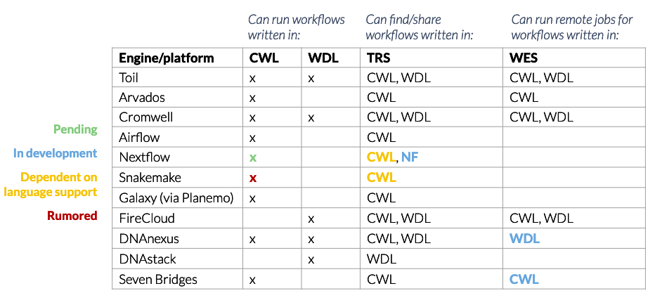

Workflow Engines
================

.. meta::
    :description lang=en: Survey of workflow engines and platforms.

There are a diverse number of workflow engines and languages available. This figure below illustrates the compatibility between the different engines and languages.

Common Workflow Language (CWL)
------------------------------

* As an organization we are working to provide Synapse support to CWL primarily

General rationale is documented below:

* CWL is literally a community-driven standard (two of its main “competitors” — Jeff Gentry / WDL and John Chilton / Galaxy — are on the leadership team). not only was it designed as a standard, but it was designed first and foremost to ensure portability and reproducibility — something that’s fairly important in our field
* there are multiple implementations of CWL (in this case, by implementations I mean execution engines or platforms that support CWL), meaning one can take a CWL tool/workflow and run it not just in different environments, but using different software. this cannot be said for Nextflow, Snakemake, Galaxy, or even WDL. if the maintainers of those platforms decide to kill the project (unlikely I know), then your workflow now has a much more finite lifespan. conversely, each of the the platforms for those languages — as mentioned — are working on support for CWL, even if it’s just at the stage of import/export
* while CWL can be harder to use and might not be quite as expressive or powerful as Nextflow and Snakemake.. it’s still pretty damn powerful. i also think it provides a particularly nice interface for Docker images, which in a lot of cases can just end up as black boxes
* CWL as a language is built on concepts related to linked data, and it provides far more support for semantics, annotation, validation of inputs/outputs, resolution of paths and locations, etc. than other platforms. I think some of these features are underutilized in most real world examples, but could be super useful if fully harnessed
* there are already multiple groups thinking about (and working implementations of) combining CWL with provenance standards (i.e., W3C PROV)
* there’s a related (still pending official approval GA4GH) API called the Tool Registry Service (TRS) that allows users to describe, share, and find tools/workflows in a standardized way. TRS and it’s main implementation, Dockstore, historically supported CWL and WDL, though now can support Nextflow as well; the folks at Biocontainers just started to roll out their own implementation of TRS, which will allow users to more easily connect their Docker images and the workflows that use them
